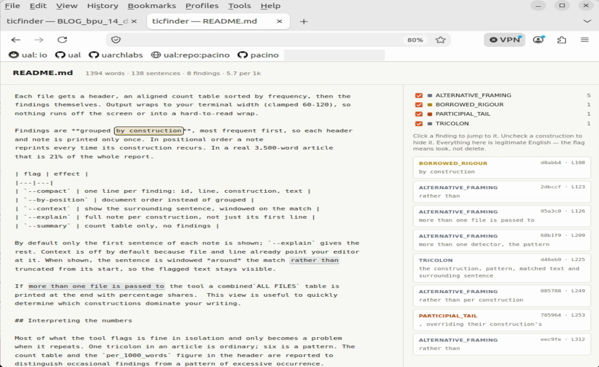

# ticfinder

Finds recurring LLM prose constructions in markdown or plain text, so a human
can decide what to cut.

ticfinder does not detect bad grammar. ticfinder looks for structural patterns
in legitimate English.  The premise is that these constructions *cluster* in LLM
generated prose, and the clustering is what breaks reader flow.

ticfinder's purpose is to make re-writes of LLM generated output more efficient
by identifying known, annoying/cringe quirks.

It is not intended as an AI-detector defeat tool, nor is it a watermark
scrubber.

## Install

```bash
pip install spacy
python3 -m spacy download en_core_web_md
```

Use `md`, not `sm`. On `a bug wrapped in an excuse trenchcoat`, the small model
attaches `trenchcoat` as `advmod` of `excuse`; `md` gets the compound right.
Parse quality is upstream of every structural detector. `en_core_web_trf` is
better still if you can afford the install.

## Use

```bash
python3 ticfinder.py article.md
python3 ticfinder.py posts/*.md --stats
python3 ticfinder.py article.md --only CORRECTIVE_CONTRAST,PARTICIPIAL_TAIL
python3 ticfinder.py article.md --model sm     # sm/md/lg/trf shorthand
python3 ticfinder.py posts/*.md --json findings.json
python3 ticfinder.py posts/*.md --summary       # counts only, no findings
```

Findings are colour-coded by confidence: red = high, yellow = medium,
grey = low. Read the high ones, skim the rest.

Colour is ANSI escapes, and it switches off automatically when stdout is not a
terminal, so `> out.log` and `| less` come out clean. `NO_COLOR` and
`TERM=dumb` are honoured too. `--plain` forces it off, `--colour` forces it on.

Note that `--ascii` does *not* remove colour since escape codes are ASCII. The two flags do different jobs -- `--ascii` handles the text, `--plain`
handles the formatting.

## What it looks for

Structural (dependency parse):

| id | what |
|---|---|
| `CORRECTIVE_CONTRAST` | rejects X, asserts Y — four surface forms |
| `ALTERNATIVE_FRAMING` | rather than / instead of / less…than |
| `NEG_ESCALATION` | didn't X, and couldn't have |
| `GAPPED_ANTITHESIS` | failed before the fix and passed after |
| `ABSTRACT_ADVERB` | structurally unable, fundamentally different |
| `EMPHATIC_REFLEXIVE` | the document itself |
| `PARTICIPIAL_TAIL` | `, making it easier to…` tacked on the end |
| `TRICOLON` | coordination of three or more |
| `DISGUISE_METAPHOR` | X wrapped in / wearing / masquerading as Y |

Phrasal (token patterns, built in):

| id | what |
|---|---|
| `FRAME_MARKER` | throat-clearing, advance organizers |
| `HOLLOW_BOOSTER` | unearned assertions of importance |
| `CLOSER` | summative wrap-ups |
| `HEDGE_STACK` | two hedges on one claim |
| `EM_DASH` | split by function; pivot uses ranked high |

Word and phrase lists are not built in. They live in
`ticfinder-phrases.json`, which ships with five groups: `BORROWED_RIGOUR`,
`CONSULTANT_REGISTER`, `LLM_DICTION`, `EMPTY_FRAME` and `VAGUE_QUANTIFIER`.
See [Phrase lists](#phrase-lists).

## Output encoding

By default output is UTF-8, and flagged em dashes appear as em dashes. Passing
argument `--ascii` for 7-bit output ticfinder's separators will also become ASCII and quoted source text is transliterated (em dash to `--`, curly quotes to straight, and so on). Any patterns that are not mapped are passed through.

ASCII mode also turns on automatically when `sys.stdout.encoding` isn't UTF-8.
Python sets that at startup and some environments leave it as ASCII, in which
case printing an em dash would crash the run.

`--json` always writes UTF-8 to disk; `--ascii` additionally sets
`ensure_ascii` so the file itself stays 7-bit.

## HTML report

```bash
python3 ticfinder.py posts/*.md --html report/
```

Writes one self-contained HTML file per article: source on the left with
findings highlighted in place, list on the right. Each card in the right panel
carries the finding id and line number, so an id can be selected and pasted
straight into `--waive`. Click either side to jump to the other. Uncheck a
construction in the legend to hide it everywhere, which is how you read past a
noisy detector without editing config.

Highlight colour is reports confidence, rust = high, amber = medium,
grey = low.

Overlapping spans are resolved with highest confidence winning,
then longest. The header reports how many were suppressed, so a large number
there means two detectors are firing on the same text and one of them probably
should not be.

Single file, no JS dependencies, no network. Opens from `file://`.

## Reading the output

Each file gets a header, an aligned count table sorted by frequency, then the
findings themselves. Output wraps to your terminal width (clamped 60-120), so
nothing runs off the screen or into a hard-to-read wrap.

Findings are **grouped by construction**, most frequent first, so each header
and note is printed only once. In positional order a note
reprints every time its construction recurs. In a real 3,500-word article
that is 21% of the whole report.

| flag | effect |
|---|---|
| `--compact` | one line per finding: id, line, construction, text |
| `--by-position` | document order instead of grouped |
| `--context` | show the surrounding sentence, windowed on the match |
| `--explain` | full note per construction, not just its first line |
| `--summary` | count table only, no findings |

By default only the first sentence of each note is shown; `--explain` gives the
rest. Context is off by default because file and line already point your editor
at it. When shown, the sentence is windowed *around* the match rather than
truncated from its start, so the flagged text stays visible.

If more than one file is passed to the tool a combined`ALL FILES` table is
printed at the end with percentage shares.  This view is useful to quickly
determine which constructions dominate your writing.

## Interpreting the numbers

Most of what the tool flags is fine in isolation and only becomes a problem
when it repeats. One tricolon in an article is ordinary; six is a pattern. The
count table and the `per_1000_words` figure in the header are reported to
distinguish occasional findings from a pattern of excessive occurrence.

There is no built-in threshold since a 'reasonable' rate depends on the
subject matter and the register. If you have writing from before you started
using an LLM, run the tool over it to get a baseline for your own prose.

Base rates also vary by document. On a technical article, six of eight
`ALTERNATIVE_FRAMING` hits were real choices between real options, and every
`CORRECTIVE_CONTRAST` survived the "was X actually claimed?" test. A domain
term can trip a detector on its own: `mutually exclusive` is `ABSTRACT_ADVERB`
and `by construction` is `BORROWED_RIGOUR`, and in a hardware document both
mean exactly what they say. A high count in one construction is a prompt to
read it, not evidence that it is wrong.

The waiver feature is offered to block reporting of structures that have
already been scanned and are acceptable.

`TRICOLON` is the clearest case of a construction that has to be read rather
than counted. Ordinary lists share the parse of a rhetorical tricolon, so every
coordination of three or more is reported and labelled by how list-like it
looks:

| label | meaning |
|---|---|
| `figure` | few enumeration signals; probably rhetorical |
| `list-like` | some signals |
| `enumeration` | several signals; probably an ordinary list |

The label comes from item count, determiners on the items, premodifiers, a cue
word in the lead-in (`conditions`, `formats`, `include`, `such as`), and
whether the members are short and of similar length. `figure` is reported at
medium confidence and the other two at low. The label is a hint, not a verdict.

Structural isomorphism was tried as a signal and removed. The classical
definition of isocolon is members of equal length and identical shape, and
Morari proposes a 55% POS-match threshold, but neither separates figure from
enumeration in technical prose: ordinary lists are parallel too -- that is what
makes them lists -- and POS mistags break identity for genuinely parallel
figures. The determiner and cue-word signals discriminate better.

A high `TRICOLON` count is expected rather than alarming. A 2026 study of
rhetorical miscalibration found tricolon to be the strongest single
differentiator between LLM and human writing (p < 0.001), at 7.13 per document
against 3.73 for human experts, and characterised it as structural filler
deployed independently of argumentative occasion.

## Working through a document

Rewriting to clear a finding can create another one. Splitting a
`PARTICIPIAL_TAIL` into two sentences promotes whatever the tail contained
into a main clause, and a three-item list there becomes a `TRICOLON`. The
total can fall while a new finding appears, so **compare the finding set
between runs, not the count.** `--compact` output diffs well for this.

Because a finding id covers the sentence containing the match, rewriting a
sentence retires its id and any waiver written against it. Waiving as you go
therefore leaves stale entries behind. Work through the document first, one
construction at a time, and take the waive list from a single clean run at
the end.

## Waivers

Each finding is assigned a short id. After reviewing a document and correcting
what needs correcting, the remaining findings can be waived:

```bash
./tools/tic_finder.py posts/BLOG_bpu_13.md --waive 46df5f,b695e7
```

Waived findings are hidden on later runs, so the reported count is the number
of findings not yet reviewed. A count of zero means every finding in the
document has been either corrected or waived.

```
posts/BLOG_bpu_13.md
  1,240 words * 4 findings (3.2 per 1k words)
  3 waived, 1 stale (no longer in the text) [posts/BLOG_bpu_13.waivers.json]
```

| flag | effect |
|---|---|
| `--waive IDS` | waive by id, or `all` for everything shown |
| `--unwaive IDS` | remove waivers, or `all` |
| `--show-waived` | include waived findings in output |
| `--waiver-dir DIR` | keep waiver files in DIR instead of beside the source |
| `--waiver-file F` | explicit path; single input file only |
| `--no-waivers` | ignore waiver files entirely |
| `--gen-waivers` | write a waiver file covering every current finding |
| `--prune-stale` | drop waivers whose text is gone from the document |

The waiver path is derived from the source stem -- `BLOG_bpu_13.md` becomes
`BLOG_bpu_13.waivers.json`. 

`--gen-waivers` writes a waiver file covering every finding currently
reported, which is the quickest way to establish a baseline on a document you
have already reviewed elsewhere. It refuses to run if the waiver file exists,
exiting non-zero without writing anything -- including when several files are
passed and only one of them already has a waiver file, so a batch run never
half-completes. It honours `--only`, `--off`, `--waiver-dir` and
`--waiver-file`, and cannot be combined with `--waive`, `--unwaive` or
`--no-waivers`. To add to an existing file, use `--waive all` instead.

### The waiver file

```json
{
  "generated_by": "ticfinder",
  "source": "posts/BLOG_bpu_13.md",
  "waivers": {
    "46df5f": {
      "construction": "TRICOLON",
      "line_when_waived": 1,
      "pattern": "tricolon",
      "text": "fast, correct, and easy to extend"
    },
    "b695e7": {
      "construction": "BORROWED_RIGOUR",
      "line_when_waived": 4,
      "pattern": "",
      "text": "ground truth"
    }
  }
}
```

Only the keys of `waivers` are used for matching. They are the finding ids, and
nothing else in the file affects whether a waiver applies.  Everything inside
each entry is there so the file is readable six months later: `construction`
and `pattern` say which rule fired, `text` shows what was waived, and
`line_when_waived` records where it was at the time. That line number is
**not** used for matching and will go stale as the document changes. The line
number assists in locating the finding during interactive edits.

`source` is checked on file load and issues a warning on mismatch.  `pattern`
names the specific detector that produced the finding.

For constructions that have more than one detector, the pattern field indicates
the detector. For example `CORRECTIVE_CONTRAST` has four detectors, the pattern
field can be used to distinguish `cc_cleft` from `cc_parallel_sibling`, etc.. 

Findings that come from a phrase list have no detector function behind them, so
the field is empty.

If every waiver is removed with `--unwaive`, the file is rewritten with an
empty `waivers` object. A file with no waivers records that
the document was reviewed; a missing file means it never was.

Waiver files are only created or modified by `--waive` and `--unwaive`. A
normal run reads them and writes nothing.

### Why ids are content hashes

The id hashes the construction, pattern, matched text and surrounding
sentence; with whitespace-normalised. The has excludes line and character
offsets, so:

- editing one paragraph does not invalidate waivers in another
- rewrapping a paragraph retains its waivers
- ensures changing a flagged sentence **does** drop the waiver

Waivers whose text has disappeared are reported as **stale** to avoid
accumulation of old waivers. Each one is listed with its id, the construction,
the line it was waived at and the text that was waived:

```
posts/BLOG_bpu_13.md
  1,240 words * 4 findings (3.2 per 1k words)
  3 waived, 2 stale (no longer in the text) [posts/BLOG_bpu_13.waivers.json]
    0416fb  was L5   FRAME_MARKER: It is worth noting
    46df5f  was L1   TRICOLON: fast, correct, and easy to extend
```

The id is what `--unwaive` takes, so a stale entry can be removed without
opening the file. `--prune-stale` drops all of them in one pass.

Stale entries are never removed automatically. A waiver goes stale because the
sentence changed, and that is either a rewrite worth recording or an accidental
revert worth noticing; the tool cannot tell which.

The waiver file records the source path it was written for and warns on
mismatch. This covers the case where two directories hold the same filename.

## When a rule is too noisy

Three levers, in order of bluntness.

**Mute an id.** `--off ALTERNATIVE_FRAMING` drops it entirely. Repeatable as a
comma list.

**Mute one pattern.** `--off af_less_than` drops a single pattern and leaves
the rest of its construction working.

**Find out what to mute.** `--patterns` reports hits per pattern rather than
per construction. A pattern with a large share is the first thing to check
when the tool feels noisy.

Patterns can carry their own confidence, overriding their construction's,
because base rates inside one rhetorical family vary enormously. `not X but Y`
is rare and diagnostic; a bare `rather than` is ordinary English. Reporting
them at the same confidence makes the good rules look unreliable.

That is also why `rather than` / `instead of` / `less...than` live under
`ALTERNATIVE_FRAMING` rather than `CORRECTIVE_CONTRAST`. Same rhetorical
family, completely different base rate. **Group ids by precision, not by
rhetorical neatness** -- an id is the unit you mute, so anything you would want
to mute separately needs its own id.

## Skipping regions

There are pragmas which enable and disables ticfinder matching:

```markdown
<!-- ticfinder_off -->
*Jeff Nye is a microprocessor architect with 35 years of experience spanning
performance modeling, RTL implementation, and architecture...*
<!-- ticfinder_on -->
```

Everything between the markers is invisible to the tool: no findings, and the
text does not count toward the per-1000-word denominator either. Line numbers
outside the region stay correct, because the region is blanked in place rather
than removed.

`<!-- ticfinder_skip -->` skips just the next blank-line-delimited block, which
is less typing for a single paragraph. An unclosed `ticfinder_off` runs to the
end of the file -- useful when all your boilerplate is at the bottom.

`ticfinder_off`, `ticfinder-off` and `ticfinder off` are all accepted, in any
case. The header reports how many regions were skipped.

Suppression is all-or-nothing for a region. There is no way to disable a single
construction inside a fence; use `--off` for that.

## Phrase lists

Word and phrase lists live in an external JSON file. Place a 
`ticfinder-phrases.json` in the working directory or beside the script and it
is picked up automatically; `--phrases FILE` overrides (repeatable),
`--no-phrases` disables.

```json
{"constructions": [
  {"id": "BORROWED_RIGOUR",
   "label": "Borrowed technical rigour",
   "note": "Ask whether the technical sense is actually intended.",
   "confidence": "low",
   "match_lemma": false,
   "phrases": ["ground truth", "threat model", "non-trivial"]}
]}
```

Two shorthands are accepted: a bare list of strings (everything becomes
`OVERUSED_PHRASE`), or a mapping of id to phrase list.

`match_lemma: true` matches inflected forms, so `leverage` also catches
`leveraged` and `leveraging`. It costs a full parse of each phrase at startup,
so use it for single words and leave it off for fixed multi-word phrases.

Phrases are best grouped by why they are a problem rather than alphabetically.
Each group becomes its own construction id, with its own row in the summary and
its own mute, so the grouping determines what can be acted on. The shipped file
defines five: `BORROWED_RIGOUR`, `CONSULTANT_REGISTER`, `LLM_DICTION`,
`EMPTY_FRAME`, and `VAGUE_QUANTIFIER`.

## Adding a construction

Structural ones are a function returning `(span, subtype)` pairs:

```python
@construction("MY_TIC", "Human-readable label",
              "What to check before cutting it.", "high")
def my_tic(doc, nlp):
    out = []
    for tok in doc:
        if tok.dep_ == "advcl" and tok.lemma_ == "suggest":
            out.append((doc[tok.left_edge.i:tok.right_edge.i + 1], "variant"))
    return out
```

A third element sets the confidence for that finding alone, overriding the
construction's. This is how `TRICOLON` reports `figure` above `enumeration`:

```python
    out.append((span, "figure", "med"))
```

Phrasal ones are entries in `PHRASE_PATTERNS` using spaCy `Matcher` syntax,
though a phrase list in JSON is usually the better home for a word list.

### Constructions vs patterns

A **construction** is a rhetorical move with a stable id. A **pattern** is one
executable query that finds one of its surface forms. One construction owns
many patterns:

```python
@construction("CORRECTIVE_CONTRAST", "Corrective contrast", "...", "high")
def cc_coordinated(doc, nlp): ...      # not X but Y

@pattern("CORRECTIVE_CONTRAST")
def cc_parallel_sibling(doc, nlp): ... # X, not Y
```

`CORRECTIVE_CONTRAST` currently has four patterns because the same move parses
four different ways -- coordinated with `but`, two-clause cleft (including
across a sentence boundary), asyndetic sibling phrases, and negated
apposition. Findings report which pattern fired in brackets, so a subtype that
turns out to be noisy can be removed without touching the id.

`@pattern` takes an optional confidence applying to every finding it produces:

```python
@pattern("TRICOLON", confidence="med")
def tricolon_parataxis(doc, nlp): ...
```

Two rules worth keeping:
- The **note** field says what to check, not "this is bad". Every construction
  is legitimate somewhere.
- One construction, many patterns. When surface forms drift, add patterns and
  keep the id. The id is what you report on and what you mute.

## Tests

```bash
./tests.py              # everything
./tests.py detectors    # one section
./tests.py -v           # show every check, not just failures
```

Exits non-zero on failure, so it works as a make target or pre-commit hook.
Six sections:

| section | what it protects |
|---|---|
| `registry` | every construction and pattern is still wired up |
| `detectors` | labelled cases: does each construction fire where it should |
| `masking` | offsets preserved, right regions blanked, pragmas honoured |
| `spans` | no detector emits an inverted, empty or zero-width span |
| `waivers` | ids survive edits and reflowing elsewhere in the document |
| `cli` | flags parse, widths respected, HTML marks do not nest |

`detectors` is the section that matters. Each row is a construction, an
expected yes or no, and a sentence. Both halves earn their place: the negative
cases are what stop a detector being loosened until it fires on ordinary
English. When a miss or a false positive turns up in real writing, add the
sentence as a row before changing any code.

`registry` exists because a careless edit once deleted three constructions
silently. The tool ran fine and simply stopped reporting them.

<!-- ticfinder_off -->

<!-- ticfinder_on -->

## Known limits

<!-- ticfinder_off -->
- Markdown masking blanks code blocks, link targets, tables, blockquotes
  and HTML, preserving offsets so line numbers stay accurate. Inline code is
  the exception: only its backticks are removed and the content is kept,
  because blanking an identifier mid-sentence left a hole the parser read
  across and invented coordinations that were not in the source. A finding
  lying entirely inside inline code is then dropped, so naming a construction
  as `not X but Y` does not flag it; one that straddles the boundary still
  reports.
- Quoted text is not suppressed. `"this is not a bug but a feature"` reports,
  because quotation marks do too many jobs to read as a mention marker. Use
  backticks when naming a construction, or fence a long quotation with
  `ticfinder_off`.
- `TRICOLON` and the phrase-list constructions are noisy by design; they are
  rate signals.
- Licensing checks are not implemented. `CORRECTIVE_CONTRAST` cannot yet tell
  you whether X was ever actually claimed earlier in the document. That check
  is the obvious next thing to build and the thing that would most improve
  precision.
<!-- ticfinder_on -->


